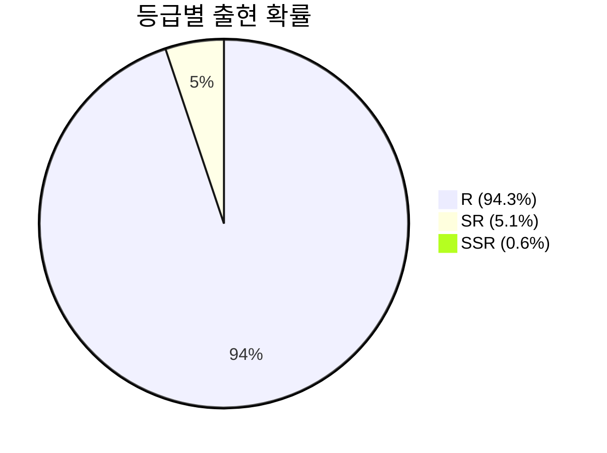
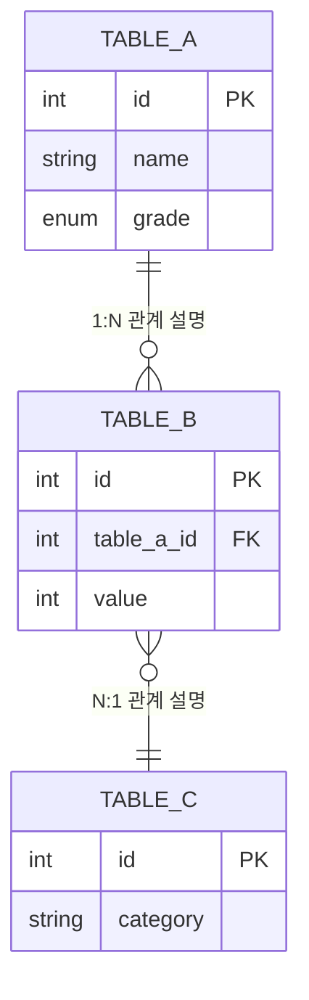
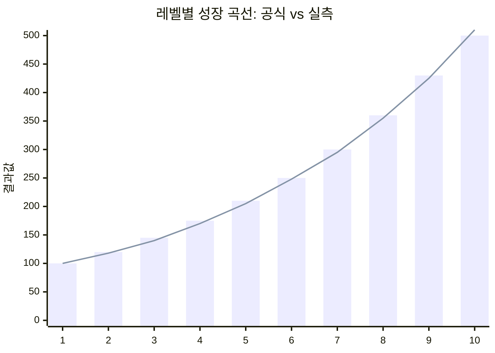

# 데이터 테이블 스펙 템플릿

> Step 8에서 사용. 시스템 구동에 필요한 데이터 구조 정의.

---

## [게임명] [시스템명] 데이터 테이블

### 1. 테이블 목록

| # | 테이블명 | 설명 | 레코드 수 (추정) |
|---|---------|------|----------------|
| 1 | (테이블A) | (역할/용도) | (예: ~50행) |
| 2 | (테이블B) | (역할/용도) | |
| 3 | (테이블C) | (역할/용도) | |

---

### 2. 테이블 상세 정의

#### 테이블A: [테이블명]

**용도**: (이 테이블이 시스템에서 하는 역할)

| 컬럼명 | 타입 | 설명 | 제약조건 | 비고 |
|--------|------|------|---------|------|
| id | INT | 고유 식별자 | PK, AUTO_INCREMENT | |
| name | STRING | 항목 이름 | NOT NULL, UNIQUE | 다국어 키 |
| grade | ENUM | 등급 | SSR/SR/R/N | |
| value | INT | 수치값 | >= 0 | |
| probability | FLOAT | 확률 | 0.0 ~ 1.0 | 소수점 4자리 |
| is_active | BOOL | 활성 여부 | DEFAULT true | |
| created_at | DATETIME | 생성일 | NOT NULL | |
| extra_data | JSON | 추가 데이터 | NULLABLE | 보상 목록 등 |

**샘플 데이터:**

| id | name | grade | value | probability | is_active |
|----|------|-------|-------|-------------|-----------|
| 1 | (항목1) | SSR | 100 | 0.006 | true |
| 2 | (항목2) | SR | 50 | 0.051 | true |
| 3 | (항목3) | R | 10 | 0.943 | true |

##### 확률/분포 시각화 (확률/분포 컬럼이 있는 경우)

> 확률 또는 분포 데이터가 있는 테이블의 비율을 시각적으로 표현한다.



> **작성 가이드:** 확률/분포 컬럼이 있는 테이블에만 적용. 세그먼트 6개 이하. 2% 이하 작은 비율은 라벨에 퍼센트를 포함 (예: `"SSR (0.6%)"`). 해당 컬럼이 없으면 이 섹션은 생략.

#### 테이블B: [테이블명]

**용도**: (이 테이블이 시스템에서 하는 역할)

| 컬럼명 | 타입 | 설명 | 제약조건 | 비고 |
|--------|------|------|---------|------|
| | | | | |

**샘플 데이터:**

| | | | |
|--|--|--|--|
| | | | |

---

### 3. ER 다이어그램



### 관계 설명

| 관계 | 유형 | 설명 |
|------|------|------|
| A → B | 1:N | (하나의 A에 여러 B가 존재) |
| B → C | N:1 | (여러 B가 하나의 C를 참조) |

---

### 4. 밸런싱 공식 (해당 시 작성)

#### 공식 1: [공식명]

```
결과값 = BaseValue × (1 + Level × GrowthRate) ^ ScaleFactor
```

| 변수 | 설명 | 값 | 출처 |
|------|------|---|------|
| BaseValue | 기본값 | 100 | 직접 측정 |
| GrowthRate | 성장 계수 | 0.15 | [추정] |
| ScaleFactor | 스케일 팩터 | 1.2 | 직접 측정 |

**검증 데이터:**

| Level | 공식 결과 | 실제 게임 값 | 오차 |
|-------|----------|------------|------|
| 1 | (계산값) | (게임값) | (%) |
| 5 | (계산값) | (게임값) | (%) |
| 10 | (계산값) | (게임값) | (%) |

##### 밸런싱 성장 곡선 시각화 (밸런싱 공식이 있는 경우)

> bar = 실제 게임 값, line = 공식 예측값으로 오차를 시각적으로 비교한다.



> **작성 가이드:** 밸런싱 공식이 있는 경우에만 작성. bar(막대)=실제 게임 측정값, line(선)=공식 예측값. x축 포인트 15~20개 이하. xychart-beta는 실험적 기능으로 일부 환경에서 렌더링이 안 될 수 있으므로, 검증 데이터 테이블을 반드시 병행한다.

---

### 5. 인덱스 & 조회 패턴 (선택)

| 조회 패턴 | 사용처 | 추천 인덱스 |
|----------|--------|-----------|
| (테이블A에서 grade별 조회) | (상점 화면) | grade |
| (테이블B에서 table_a_id로 조회) | (상세 팝업) | table_a_id |

---

### 작성 가이드

- 모든 테이블에 PK(Primary Key)를 정의한다
- FK(Foreign Key)가 있으면 반드시 ER 다이어그램에 표현한다
- ER 다이어그램은 래퍼 클래스 `mermaid-tall` 사용 (가로 배치, `mermaid.initialize()`에서 `layoutDirection: 'LR'` 적용됨)
- 샘플 데이터는 실제 게임에서 추출한 값을 사용한다
- [추정] 데이터는 추정 근거를 비고에 기록한다
- 밸런싱 공식은 검증 데이터로 오차율을 확인한다
