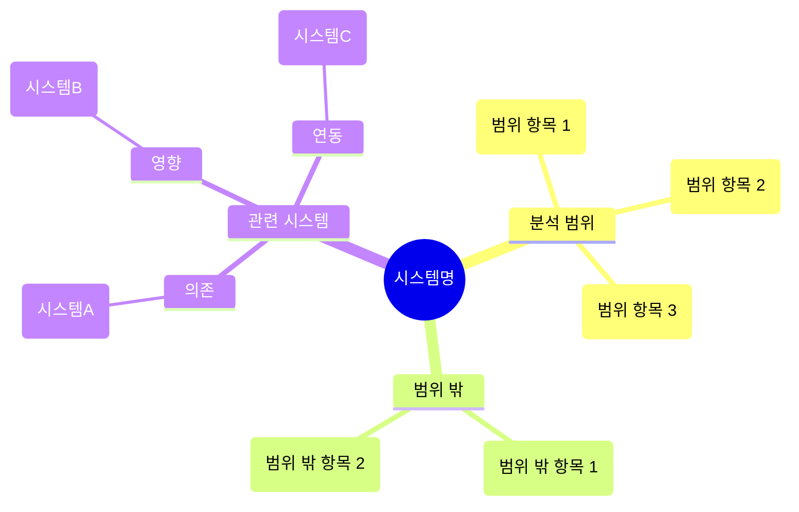
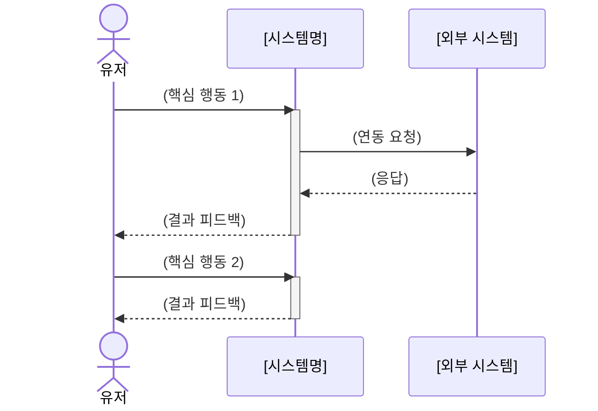

# 정의서 템플릿

> Step 4에서 사용. 시스템의 전체 윤곽을 정의하는 기초 문서.

---

## [게임명] [시스템명] 정의서

### 1. 시스템 개요

| 항목 | 내용 |
|------|------|
| 시스템명 | [게임명] [시스템명] |
| 한 줄 정의 | (30자 이내) |
| 분석 버전 | [게임 버전 / 패치] |
| 분석일 | [YYYY-MM-DD] |

### 2. 핵심 목적

| 관점 | 목적 |
|------|------|
| 유저 관점 | (유저가 이 시스템을 통해 얻는 가치) |
| 사업 관점 | (이 시스템이 사업에 기여하는 방식) |

### 3. 용어 정의

| 용어 | 정의 | 비고 |
|------|------|------|
| (용어1) | (정의) | (게임 내 표기, 약어 등) |
| (용어2) | (정의) | |
| (용어3) | (정의) | |

> 최소 3개 이상의 용어를 정의한다. 시스템 내에서 사용되는 모든 전문 용어를 포함.

### 4. 분석 범위

#### 이 문서에서 다루는 것
- (범위 항목 1)
- (범위 항목 2)
- (범위 항목 3)

#### 이 문서에서 다루지 않는 것
- (범위 밖 항목 1) → 관련 문서: (링크 또는 참조)
- (범위 밖 항목 2)

### 5. 관련 시스템

| 시스템 | 관계 유형 | 설명 |
|--------|----------|------|
| (시스템A) | 의존 (이 시스템이 A에 의존) | (어떤 데이터/기능을 사용하는지) |
| (시스템B) | 영향 (이 시스템이 B에 영향) | (어떤 결과를 전달하는지) |
| (시스템C) | 연동 (양방향) | (상호 작용 내용) |

#### 분석 범위 & 관련 시스템 마인드맵

> 섹션 4 "분석 범위"와 섹션 5 "관련 시스템"을 하나의 시각적 개요로 통합한다.

> **작성 가이드:** 루트=시스템명, 깊이 3단계 이내. 기존 텍스트 리스트와 테이블은 상세 정보용으로 유지. 마인드맵은 전체 구조를 한눈에 파악하는 시각적 개요 역할.

### 6. 대상 유저 행동

이 시스템에서 유저가 수행하는 핵심 행동:

| # | 유저 행동 | 빈도 | 설명 |
|---|----------|------|------|
| 1 | (행동 1: "~한다" 형태) | 일일/주간/이벤트성 | (간단한 설명) |
| 2 | (행동 2) | | |
| 3 | (행동 3) | | |

#### 핵심 인터랙션 요약

> 유저-시스템-외부시스템 간 핵심 행동 3~5개의 시퀀스를 요약한다. Step 6 플로우차트의 프리뷰 역할.

> **작성 가이드:** 유저의 핵심 행동 3~5개를 간략히 시퀀스로 표현. 상세한 분기나 에러 처리는 생략하고 정상 흐름만 포함. 참여자는 유저 + 분석 대상 시스템 + 관련 외부 시스템(있는 경우).

### 7. 시스템 배경 맥락 (선택)

> 시스템 이해에 필요한 최소한의 세계관/스토리 맥락. 1~3줄 이내.

(시스템과 직접 관련된 배경 정보만 간결하게 기술)

---

### 작성 가이드

- 모든 항목을 빈칸 없이 채운다
- 용어 정의 표의 용어는 이후 모든 문서에서 일관되게 사용한다
- "범위 밖" 항목을 통해 문서의 경계를 명확히 한다
- 관련 시스템의 관계 유형(의존/영향/연동)을 정확히 구분한다
