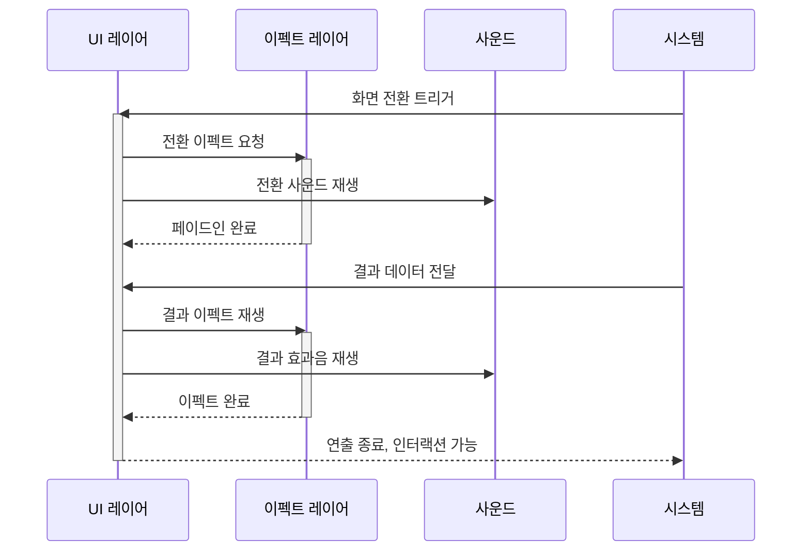
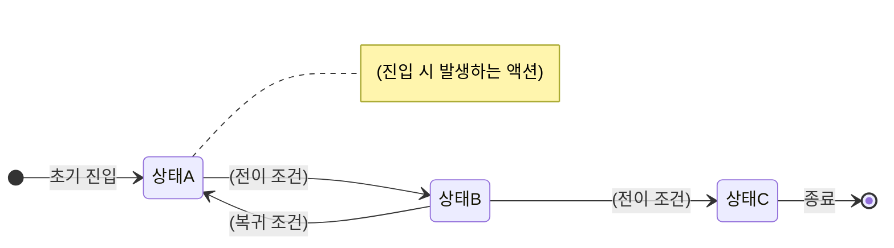

# 상세 명세서 템플릿

> Step 7에서 사용. 개발자가 구현에 필요한 세부 사항을 빠짐없이 기술.

---

## [게임명] [시스템명] 상세 명세서

### 1. UI 레이아웃

#### 화면 구성

| 영역 | 위치 | 구성 요소 | 비율/크기 |
|------|------|----------|----------|
| 상단 바 | 최상단 | (요소 나열) | 높이 ~8% |
| 메인 콘텐츠 | 중앙 | (요소 나열) | 높이 ~75% |
| 하단 액션 | 최하단 | (요소 나열) | 높이 ~17% |

#### 요소 상세

| 요소 | 형태 | 내용 | 상태별 변화 |
|------|------|------|-----------|
| (요소1) | 버튼/텍스트/아이콘 등 | (표시 내용) | 활성/비활성/숨김 조건 |
| (요소2) | | | |

#### 스크롤/네비게이션

| 동작 | 방향 | 범위 | 비고 |
|------|------|------|------|
| (스크롤/탭 전환 등) | 세로/가로 | (스크롤 영역) | (스냅, 페이징 등) |

---

### 2. 인터랙션 명세

| 대상 요소 | 입력 방식 | 동작 | 피드백 |
|----------|----------|------|--------|
| (버튼A) | 탭 | (실행되는 동작) | (시각: 눌림 효과 / 청각: 효과음 / 촉각: 진동) |
| (영역B) | 스와이프 좌→우 | (실행되는 동작) | |
| (아이템C) | 롱프레스 (0.5초) | (실행되는 동작) | |
| (슬라이더D) | 드래그 | (실행되는 동작) | |

#### 입력 방식 정의

| 입력 | 조건 | 설명 |
|------|------|------|
| 탭 | 0.3초 이내 터치 후 릴리스 | 가장 기본적인 입력 |
| 더블탭 | 0.5초 이내 2회 탭 | |
| 롱프레스 | 0.5초 이상 터치 유지 | |
| 스와이프 | 50px 이상 이동 후 릴리스 | 방향: 상/하/좌/우 |
| 드래그 | 터치 유지한 채 이동 | |
| 핀치 | 두 손가락 벌림/오므림 | 줌 관련 |

---

### 3. 애니메이션 명세

| 트리거 | 애니메이션 | 재생 시간 | 이징 | 반복 |
|--------|----------|----------|------|------|
| (화면 진입) | (전환 효과 설명) | 0.3초 | ease-out | 1회 |
| (성공 시) | (성공 이펙트 설명) | 1.0초 | ease-in-out | 1회 |
| (루프) | (반복 애니메이션 설명) | 2.0초 | linear | 무한 |

#### 핵심 연출 시퀀스 (주요 연출이 있는 경우)

```
[0.0초] 화면 전환 시작
[0.3초] 메인 요소 페이드인
[0.5초] 결과 표시 시작
[1.5초] 이펙트 재생
[2.5초] 결과 확정 & 인터랙션 가능
```

#### 레이어 간 타이밍 시퀀스 (주요 연출이 있는 경우)

> 위 텍스트 타임라인을 레이어 간 인터랙션으로 시각화한 다이어그램.



> **작성 가이드:** 참여자는 UI 레이어, 이펙트 레이어, 사운드, 시스템으로 구성한다. `activate`/`deactivate`로 각 레이어의 활성 구간을 표현한다. 연출이 단순한 경우(1~2단계) 이 다이어그램은 생략 가능하다.

---

### 4. 사운드 명세

| 트리거 | 사운드 유형 | 설명 | 볼륨 |
|--------|-----------|------|------|
| (버튼 탭) | SFX | (효과음 설명) | 100% |
| (성공) | SFX | (효과음 설명) | 120% |
| (화면 진입) | BGM 전환 | (BGM 변경 설명) | 페이드 (1초) |

---

### 5. 텍스트/메시지 명세

| 조건 | 메시지 유형 | 텍스트 원문 | 표시 방식 |
|------|-----------|-----------|----------|
| (성공) | 토스트 | "(실제 게임 텍스트)" | 2초 표시 후 자동 소멸 |
| (실패) | 팝업 | "(실제 게임 텍스트)" | 확인 버튼 탭 시 닫힘 |
| (재화 부족) | 팝업 + 바로가기 | "(실제 게임 텍스트)" | 충전 버튼 포함 |
| (안내) | 툴팁 | "(실제 게임 텍스트)" | 영역 밖 탭 시 닫힘 |

---

### 6. 상태 전이 명세

#### 상태 목록

| 상태 | 설명 | 진입 조건 |
|------|------|----------|
| (상태A) | (설명) | (이 상태가 되는 조건) |
| (상태B) | (설명) | |
| (상태C) | (설명) | |

#### 상태 전이 다이어그램

> 상태 목록과 전이 매트릭스의 시각적 개요. 전체 상태 흐름을 한눈에 파악하는 용도.



> **작성 가이드:** `stateDiagram-v2`로 작성. 노드 12개 이하 유지. 아래 텍스트 매트릭스와 내용이 일치해야 한다. 복합 상태(내부 하위 상태)가 있으면 `state 상태명 { ... }` 1단계까지 사용 가능.

#### 상태 전이 매트릭스

| From \ To | 상태A | 상태B | 상태C |
|-----------|-------|-------|-------|
| 상태A | - | (조건) | X |
| 상태B | (조건) | - | (조건) |
| 상태C | X | X | - |

> `-`: 자기 자신, `X`: 전이 불가, `(조건)`: 해당 조건 충족 시 전이 가능

#### 전이 시 발생 액션

| 전이 | 액션 | 설명 |
|------|------|------|
| A → B | (발생하는 액션) | (재화 차감, 아이템 지급 등) |
| B → C | (발생하는 액션) | |

---

### 작성 가이드

- UI 레이아웃은 스크린샷 없이도 화면을 재현할 수 있을 만큼 상세하게
- 인터랙션은 모든 터치 가능 요소를 빠짐없이 커버
- 애니메이션 타이밍은 초 단위로 측정 (대략적이라도)
- 텍스트는 실제 게임에서 확인한 원문을 사용
- 상태 전이 매트릭스에서 모든 상태 쌍의 전이 가능 여부를 정의
