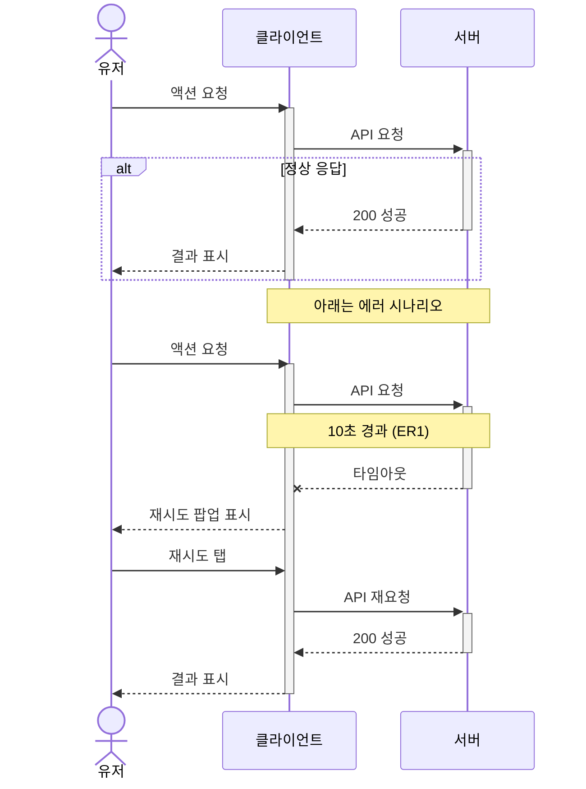
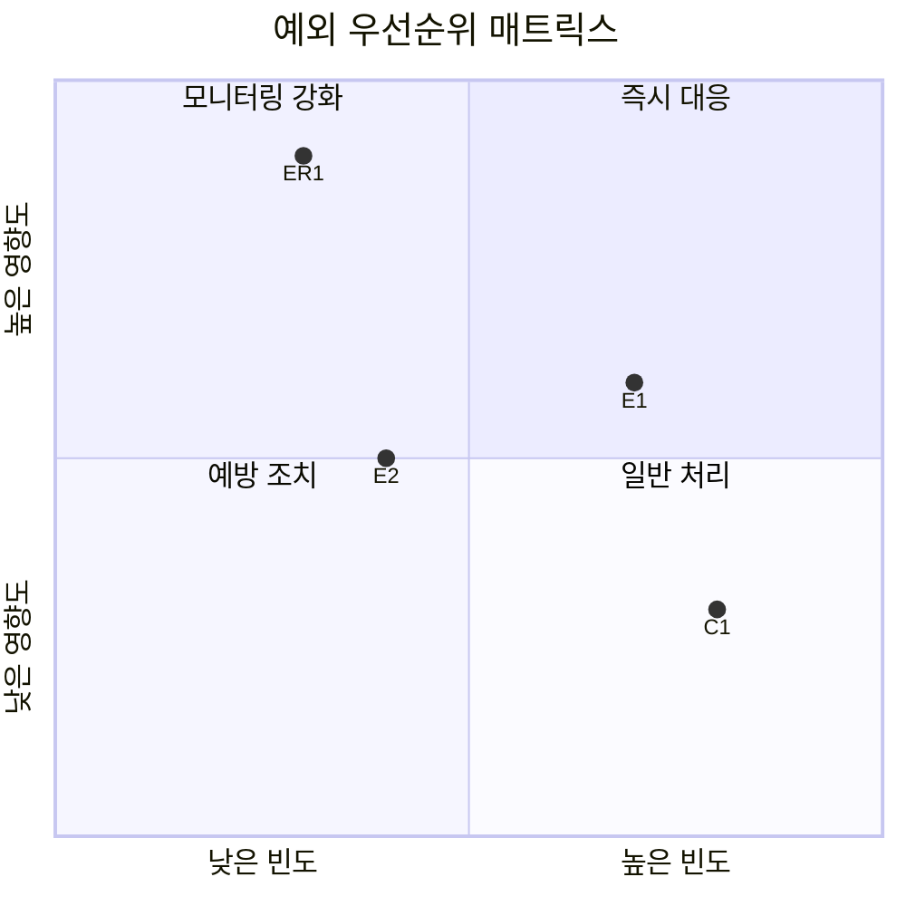
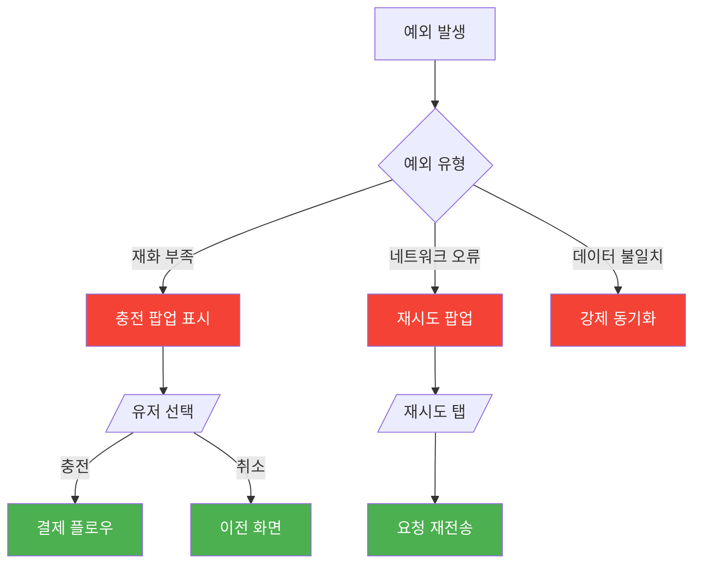

# 예외 처리 스펙 템플릿

> Step 9에서 사용. 정상 흐름 외 모든 예외 상황과 대응 정의.

---

## [게임명] [시스템명] 예외 처리 명세

### 1. 엣지 케이스

| # | 예외 상황 | 발생 조건 | 시스템 반응 | 유저 피드백 | 우선순위 |
|---|----------|----------|-----------|-----------|---------|
| E1 | (상황 설명) | (구체적 조건) | (시스템 동작) | (메시지/UI 변화) | 높음/중간/낮음 |
| E2 | | | | | |
| E3 | | | | | |

> 최소 3개 이상의 엣지 케이스를 분석한다.

#### 엣지 케이스 분석 가이드

체크할 상황:
- [ ] 재화/재료가 정확히 0일 때
- [ ] 재화가 필요량과 정확히 같을 때
- [ ] 인벤토리/슬롯이 꽉 찬 상태에서 아이템 획득
- [ ] 최대 레벨/강화 도달 상태에서 추가 시도
- [ ] 최초 사용 (초기 데이터 상태)
- [ ] 이미 보유한 아이템을 중복 획득
- [ ] 시간 제한 콘텐츠의 만료 직전/직후

---

### 2. 사이드 이펙트

| # | 트리거 액션 | 영향 받는 시스템 | 사이드 이펙트 | 처리 순서 |
|---|-----------|---------------|-------------|----------|
| S1 | (이 시스템의 액션) | (다른 시스템명) | (발생하는 변화) | (동기/비동기) |
| S2 | | | | |

#### 사이드 이펙트 분석 가이드

체크할 연동:
- [ ] 재화 변동 → 다른 시스템의 조건 변화
- [ ] 아이템 획득/소모 → 도감/업적/컬렉션 업데이트
- [ ] 레벨/능력치 변화 → 잠금 해제, 콘텐츠 오픈
- [ ] 구매/강화 → 통계/로그 기록
- [ ] 상태 변화 → UI 뱃지/알림 업데이트

---

### 3. 동시성 이슈

| # | 시나리오 | 발생 조건 | 위험도 | 대응 방법 |
|---|---------|----------|--------|----------|
| C1 | (동시 요청 상황) | (구체적 시나리오) | 높음/중간/낮음 | (락/큐/무시 등) |
| C2 | | | | |

#### 동시성 이슈 분석 가이드

체크할 시나리오:
- [ ] 빠른 연속 탭 (더블 탭 방지)
- [ ] 네트워크 지연 중 재시도
- [ ] 여러 기기에서 동시 접속
- [ ] 타이머 만료와 유저 액션 동시 발생
- [ ] 서버 응답 대기 중 화면 전환
- [ ] 결제 프로세스 중 앱 백그라운드 전환

---

### 4. 리소스 한계

| # | 리소스 | 하한값 | 상한값 | 도달 시 처리 |
|---|--------|--------|--------|------------|
| R1 | (리소스명) | (최소값) | (최대값) | (UI 표시/동작 제한 등) |
| R2 | | | | |

#### 리소스 한계 분석 가이드

체크할 한계:
- [ ] 재화 최대 보유량
- [ ] 인벤토리 슬롯 수
- [ ] 일일/주간 참여 횟수
- [ ] 레벨/강화 상한
- [ ] 스택/중첩 최대 수
- [ ] 동시 진행 가능 개수

---

### 5. 에러 처리

| # | 에러 유형 | 발생 원인 | 클라이언트 처리 | 서버 처리 | 유저 메시지 |
|---|----------|----------|---------------|----------|-----------|
| ER1 | 네트워크 타임아웃 | 서버 응답 없음 (>10초) | 재시도 팝업 표시 | 요청 롤백 | "일시적 오류가 발생했습니다. 다시 시도해주세요." |
| ER2 | 데이터 불일치 | 클라이언트-서버 싱크 오류 | 강제 동기화 | 서버 기준 적용 | (무음 처리 또는 새로고침) |
| ER3 | | | | | |

#### 클라이언트-서버 에러 처리 시퀀스

> 위 에러 테이블의 핵심 에러 1~2개를 시간축으로 시각화한 다이어그램.

> **작성 가이드:** 에러 시나리오별로 별도 시퀀스로 분리하여 표현 (`alt/else` 내에서 동일 참여자의 `activate/deactivate`를 중복 사용하면 렌더링 에러 발생). `--x` 화살표로 실패를 시각화. `+`/`-` 단축 문법(`->>+`, `-->>-`) 권장. 모든 에러를 다이어그램화할 필요 없이 영향도가 높은 에러 1~2개만 선택.

---

### 5-1. 예외 우선순위 매트릭스

> 모든 예외를 빈도(X축) × 영향도(Y축)로 포지셔닝하여 대응 우선순위를 시각화한다.

> **작성 가이드:** 좌표 0.0~1.0 범위. 각 예외를 위 섹션의 ID(E1, S1, C1, R1, ER1)로 표기. 사분면 라벨은 반드시 `"따옴표"`로 감싸기. 데이터 포인트 라벨은 영문 ID만 사용. 사분면: 우상=즉시 대응, 좌상=모니터링 강화, 좌하=예방 조치, 우하=일반 처리.

---

### 6. 예외 상황별 플로우 (핵심 예외만)

---

### 작성 가이드

- 모든 예외에 "조건 → 시스템 반응 → 유저 피드백" 3요소를 반드시 포함
- 우선순위는 발생 빈도 × 영향도로 판단
- 동시성 이슈는 서버/클라이언트 양쪽의 대응을 기술
- 에러 메시지는 실제 게임의 원문을 사용
- 최소 3개 엣지 케이스 + 1개 동시성 이슈 + 1개 에러 처리를 포함
