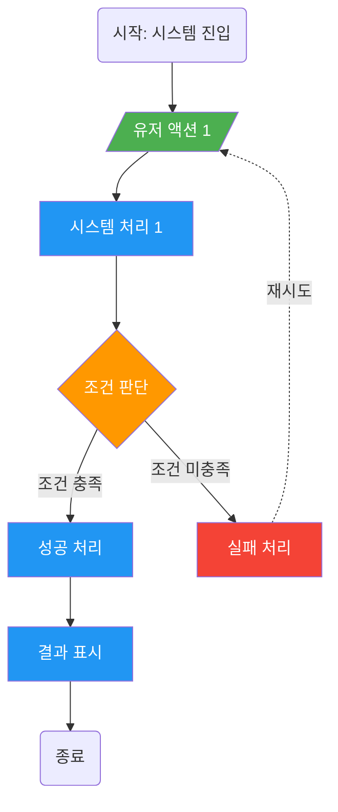
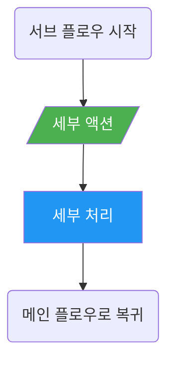

# 플로우차트 스펙 템플릿

> Step 6에서 사용. 유저 행동 흐름과 시스템 반응을 단계별로 표현.

---

## [게임명] [시스템명] 플로우차트

### 메인 플로우 (Happy Path)

### 범례

| 요소 | 모양 | 색상 | 의미 |
|------|------|------|------|
| 유저 액션 | 평행사변형 `/텍스트/` | 초록 (#4CAF50) | 유저가 직접 수행하는 행동 |
| 시스템 처리 | 사각형 `[텍스트]` | 파랑 (#2196F3) | 시스템이 자동 수행하는 처리 |
| 조건 분기 | 다이아몬드 `{텍스트}` | 주황 (#FF9800) | 조건에 따른 분기점 |
| 에러/예외 | 사각형 `[텍스트]` | 빨강 (#f44336) | 예외 상황 처리 |
| 시작/종료 | 둥근 사각형 `(텍스트)` | 기본 | 플로우의 진입/이탈점 |
| 서브 프로세스 | 이중 사각형 `[[텍스트]]` | 보라 | 별도 플로우로 분리된 처리 |

### 플로우 상세 설명

| 단계 | 요소 | 설명 | 비고 |
|------|------|------|------|
| 1 | (유저 액션 1) | (구체적 행동 설명) | (입력 방식: 탭/스와이프 등) |
| 2 | (시스템 처리 1) | (처리 내용) | (서버/클라이언트) |
| 3 | (조건 판단) | (판단 기준) | (구체적 조건값) |

---

### 서브 플로우 (필요 시)

복잡도가 높아 메인 플로우에서 분리한 세부 흐름.

#### 서브 플로우 1: [이름]

---

### 분리 기준

- **노드 15개 초과**: 반드시 서브 플로우로 분리
- **조건 3단계 중첩**: 분기점별로 서브 플로우 분리
- **독립 기능 블록**: 재사용 가능한 로직은 서브 플로우로 분리

### 작성 가이드

1. Happy Path를 먼저 완성한 후 예외 경로를 추가한다
2. 모든 경로가 종료점에 도달해야 한다 (데드엔드 금지)
3. 조건문은 구체적으로 표기한다 ("조건 충족" → "재화 ≥ 100")
4. 서버/클라이언트 처리를 구분한다 (subgraph 또는 주석)
