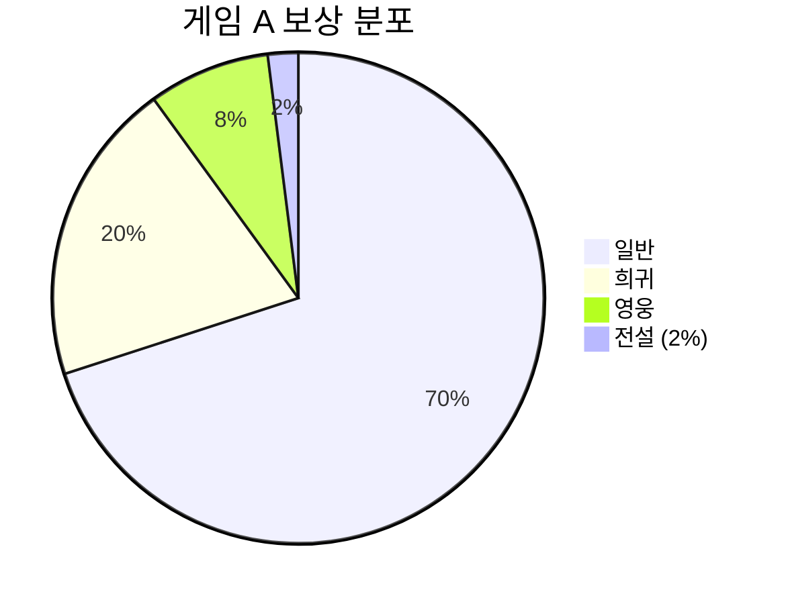
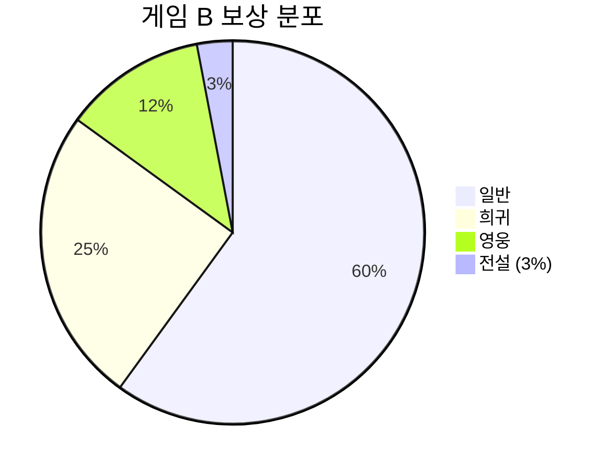
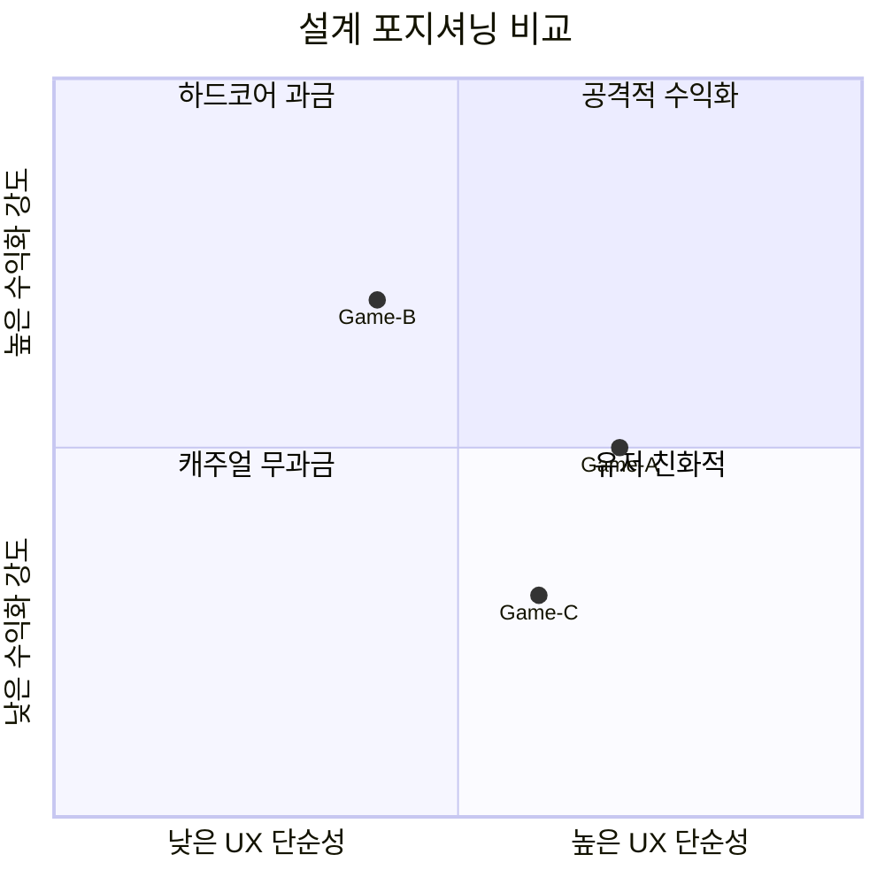

# 비교 분석 스펙 템플릿

> Step 10에서 사용. 동일 시스템을 가진 다른 게임과의 비교 분석.

---

## [시스템명] 크로스 역기획 비교 분석

### 1. 비교 대상

| 항목 | 게임 A (분석 대상) | 게임 B (비교 1) | 게임 C (비교 2, 선택) |
|------|-------------------|----------------|---------------------|
| 게임명 | | | |
| 장르 | | | |
| 플랫폼 | | | |
| 출시일 | | | |
| 분석 시스템 | | | |

### 선정 이유

| 게임 | 선정 이유 |
|------|----------|
| 게임 B | (왜 이 게임을 비교 대상으로 선택했는지) |
| 게임 C | (왜 이 게임을 비교 대상으로 선택했는지) |

---

### 2. 비교 매트릭스

#### 기능 비교

| 비교 항목 | 게임 A | 게임 B | 게임 C |
|----------|--------|--------|--------|
| 핵심 메카닉 | | | |
| 하위 기능 수 | | | |
| 진입 조건 | | | |
| 완료 조건 | | | |
| 보상 구조 | | | |

#### UX 비교

| 비교 항목 | 게임 A | 게임 B | 게임 C |
|----------|--------|--------|--------|
| 핵심 플로우 탭 수 | | | |
| 튜토리얼 유무 | | | |
| 정보 표시 방식 | | | |
| 피드백 품질 | | | |

#### 수익화 비교

| 비교 항목 | 게임 A | 게임 B | 게임 C |
|----------|--------|--------|--------|
| 과금 포인트 | | | |
| 무과금 접근 한계 | | | |
| BM 연동 방식 | | | |
| 예상 ARPU 기여 | | | |

#### 밸런싱 비교

| 비교 항목 | 게임 A | 게임 B | 게임 C |
|----------|--------|--------|--------|
| 성장 속도 제어 장치 | | | |
| P2W 완화 장치 | | | |
| 인플레이션 방지 | | | |
| 상한/하한 설정 | | | |

---

#### 보상/확률 분포 비교 (보상/확률 분포 비교 시)

> 게임별 보상/확률 분포를 pie 차트로 병렬 비교한다.

**게임 A:**

**게임 B:**

> **작성 가이드:** 보상/확률 분포 비교가 있는 경우에만 작성. 게임당 1개 pie 차트, 세그먼트 6개 이하. 분포 비교가 없으면 이 섹션은 생략.

---

### 3. 트레이드오프 분석

| 관점 | 게임 A의 선택 | 게임 B의 선택 | 트레이드오프 |
|------|-------------|-------------|------------|
| (관점1) | (A가 선택한 방식) | (B가 선택한 방식) | (각 선택의 장단점) |
| (관점2) | | | |
| (관점3) | | | |

#### 설계 포지셔닝

> 분석 대상의 2가지 핵심 차원에서 각 게임의 설계 포지셔닝을 비교한다.

> **작성 가이드:** 축의 2개 차원은 분석 대상에 맞게 선택 (예: UX 단순성 vs 수익화 강도, 전략 깊이 vs 접근성 등). 각 게임을 좌표로 포지셔닝. 사분면 라벨은 반드시 `"따옴표"`로 감싸기. 데이터 포인트 라벨은 영문 ID만 사용 (예: `Game-A`, `Game-B`).

---

### 4. 인사이트

#### 인사이트 1: [제목]
- **발견**: (비교를 통해 발견한 사실)
- **원인 분석**: (왜 이런 차이가 발생하는지)
- **시사점**: (기획 시 고려할 점)

#### 인사이트 2: [제목]
- **발견**:
- **원인 분석**:
- **시사점**:

#### 인사이트 3: [제목]
- **발견**:
- **원인 분석**:
- **시사점**:

---

### 5. 개선안 제시 (선택)

| # | 개선 영역 | 현재 방식 | 개선안 | 기대 효과 |
|---|----------|----------|--------|----------|
| 1 | (영역) | (현재 시스템의 방식) | (구체적 개선 스펙) | (수치적 예측) |
| 2 | | | | |

> 개선안은 구체적 스펙을 포함해야 한다. "더 좋게 만든다" 수준은 불가.

---

### 작성 가이드

- 비교 대상은 1~2개가 적정 (3개 이상은 분석이 얕아짐)
- 비교 매트릭스는 주관적 평가가 아닌 사실 기반으로 작성
- 트레이드오프는 "A가 낫다"가 아닌 "A는 ~에 유리하고, B는 ~에 유리하다" 형태
- 인사이트는 최소 3개 도출
- 개선안은 구현 가능한 수준의 구체적 스펙을 포함
