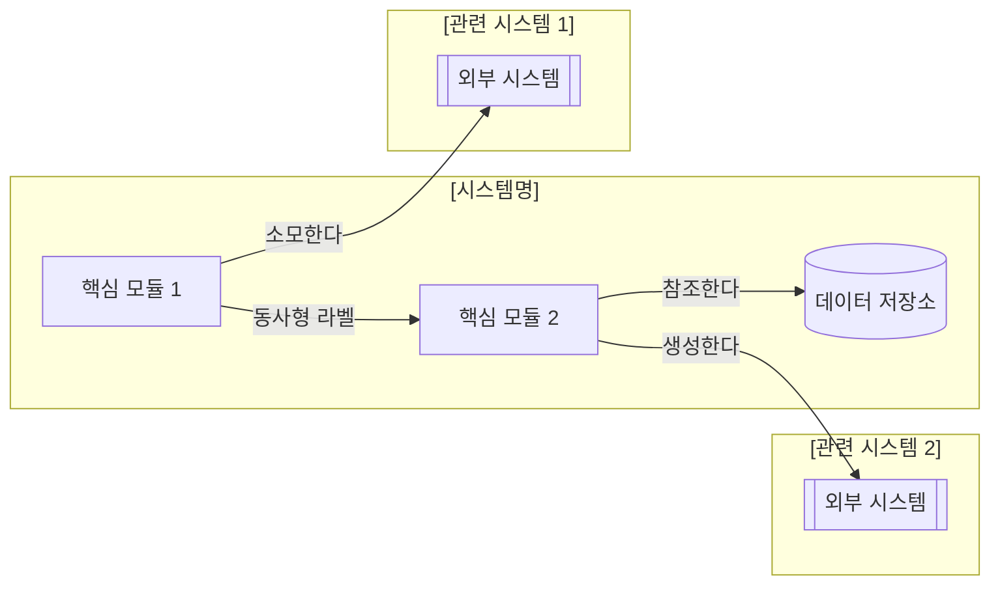

# 구조도 스펙 템플릿

> Step 5에서 사용. 시스템의 구성 요소와 관계를 Mermaid 다이어그램으로 표현.

---

## [게임명] [시스템명] 구조도

### 메인 구조도

### 범례

| 기호 | 의미 |
|------|------|
| `[이름]` | 내부 모듈/컴포넌트 |
| `[(이름)]` | 데이터 저장소 (DB/테이블) |
| `[[이름]]` | 외부 연동 시스템 |
| `→` 실선 | 데이터/제어 흐름 |
| `-.->` 점선 | 선택적/비동기 연결 |
| `subgraph` | 시스템 경계 |

### 노드 상세 설명

| 노드 | 역할 | 주요 기능 |
|------|------|----------|
| (노드A) | (역할 설명) | (핵심 기능 1~2줄) |
| (노드B) | (역할 설명) | (핵심 기능 1~2줄) |

### 관계선 상세 설명

| 연결 | 관계 | 데이터/이벤트 |
|------|------|-------------|
| A → B | (관계 유형) | (전달되는 데이터 또는 트리거) |
| B → C | (관계 유형) | (전달되는 데이터 또는 트리거) |

---

### 작성 가이드

- **방향**: `graph LR`(왼→오) 기본. 시스템 간 관계를 가로로 배치하여 가독성 확보
- **subgraph 내부 방향**: `direction LR` 명시하여 하위 모듈도 가로 배치
- **래퍼 클래스**: HTML 출력 시 `mermaid-wrapper mermaid-tall` 사용 (가로 폭 확보)
- **노드 수 제한**: 메인 구조도 15개 노드 이하
- **초과 시**: 하위 구조도로 분리하고 `[[서브시스템]]`으로 표시
- **라벨**: 모든 노드에 한국어, 관계선에 동사형 라벨
- **subgraph**: 시스템 경계를 명확히 구분
