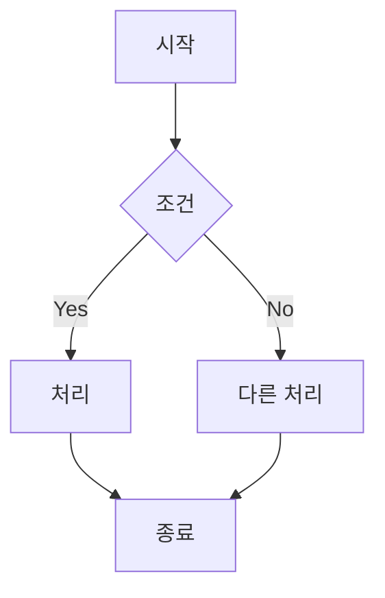
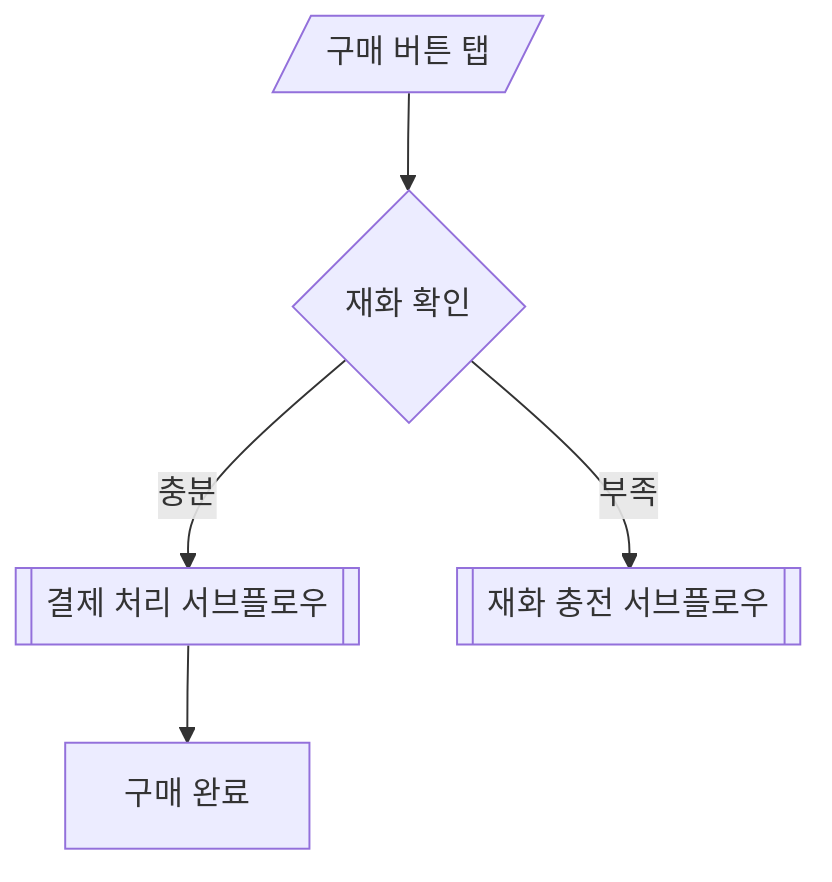
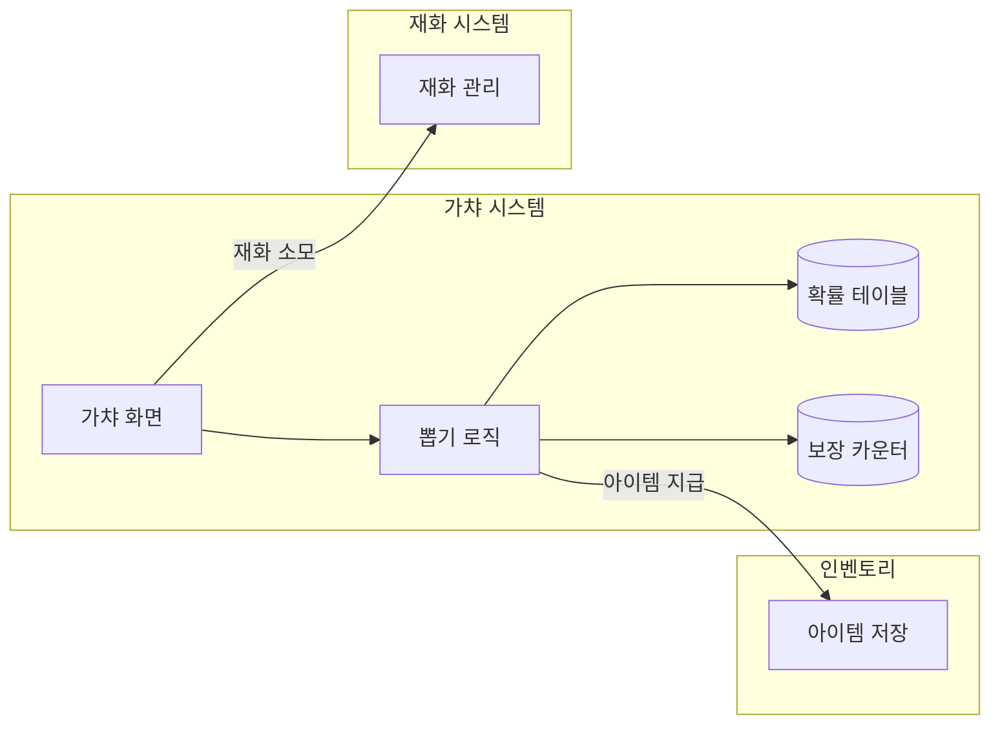
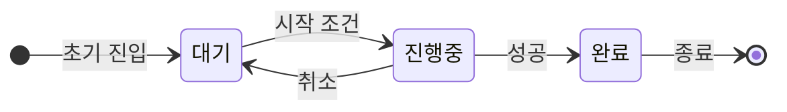
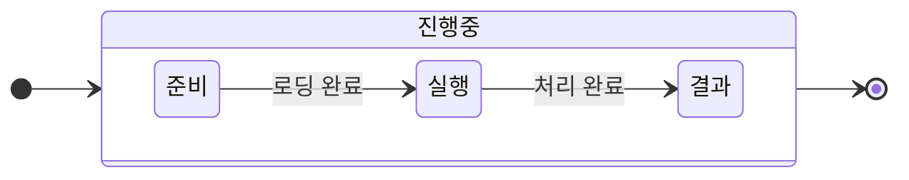
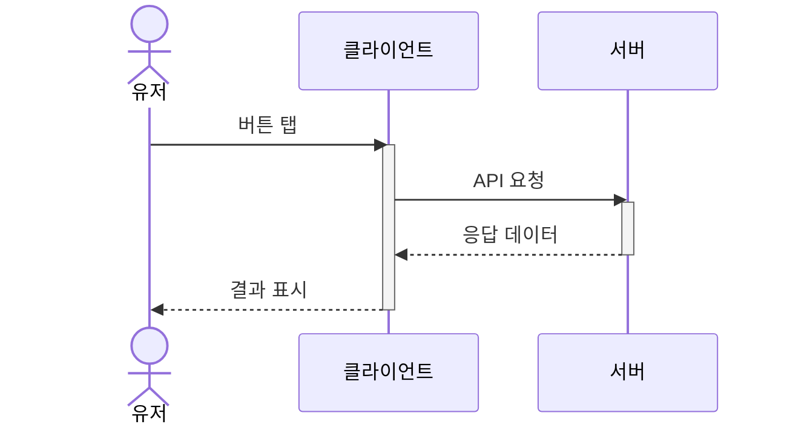
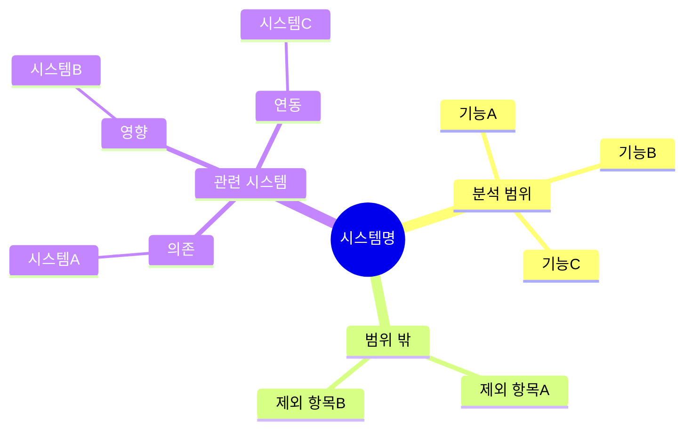
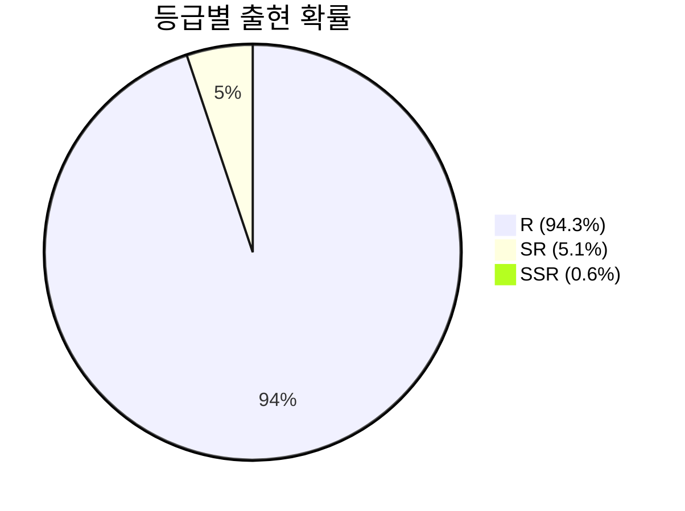
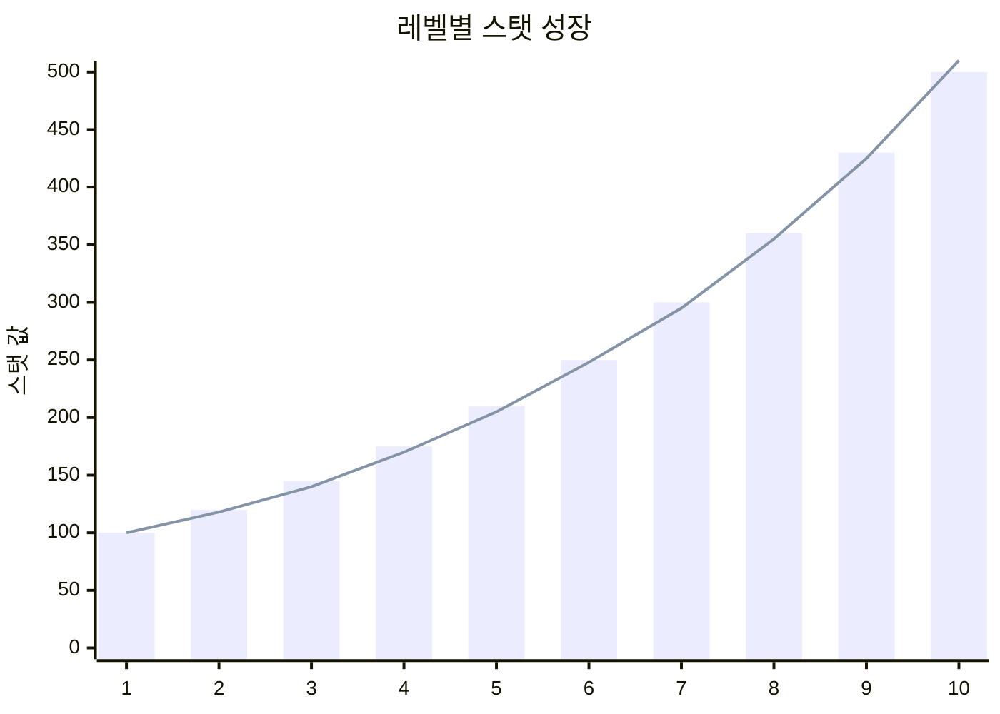
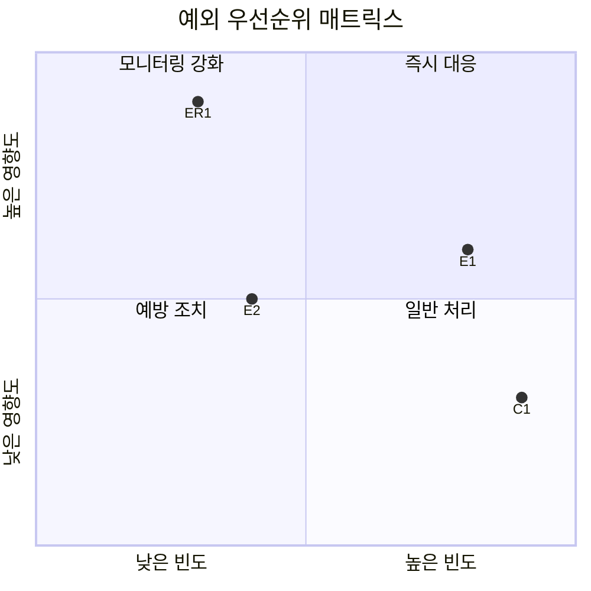

# 플로우차트 & 다이어그램 표기법

> 역기획서에서 사용하는 Mermaid 다이어그램 표기 컨벤션.

---

## Mermaid Flowchart 핵심 문법

### 기본 구조



### 노드 유형

| 모양 | 문법 | 용도 |
|------|------|------|
| 사각형 `[텍스트]` | `A[텍스트]` | 일반 처리, 시스템 동작 |
| 둥근 사각형 `(텍스트)` | `A(텍스트)` | 시작/종료점 |
| 다이아몬드 `{텍스트}` | `A{텍스트}` | 조건 분기 |
| 평행사변형 `[/텍스트/]` | `A[/텍스트/]` | 유저 입력/액션 |
| 이중 사각형 `[[텍스트]]` | `A[[텍스트]]` | 서브 프로세스 |
| 원통 `[(텍스트)]` | `A[(텍스트)]` | 데이터베이스/저장소 |
| 육각형 `{{텍스트}}` | `A{{텍스트}}` | 이벤트/트리거 |

---

## 역기획서 전용 표기 컨벤션

### 노드 라벨 규칙

1. **모든 노드에 한국어 라벨** 필수
2. **유저 액션**: "~한다" 동사형 (예: "상품을 선택한다")
3. **시스템 처리**: "~처리" 명사형 (예: "재화 차감 처리")
4. **조건**: "~인가?" 의문형 (예: "재화 충분인가?")

### 색상/스타일 컨벤션


| 색상 | 용도 | 클래스명 |
|------|------|---------|
| 초록 (#4CAF50) | 유저 액션 | userAction |
| 파랑 (#2196F3) | 시스템 처리 | systemProcess |
| 주황 (#FF9800) | 조건 분기 | condition |
| 빨강 (#f44336) | 에러/예외 처리 | error |
| 보라 (#9C27B0) | 서브 프로세스 | subProcess |

### 관계선 컨벤션

| 선 유형 | 문법 | 용도 |
|---------|------|------|
| 실선 화살표 | `-->` | 정상 흐름 |
| 점선 화살표 | `-.->` | 예외/선택 경로 |
| 굵은 화살표 | `==>` | 핵심 경로 (Happy Path) |
| 라벨 있는 선 | `--\|라벨\|-->` | 조건 결과 표시 |

---

## 복잡도 관리 규칙

### 노드 수 제한

- **단일 플로우차트: 최대 15개 노드**
- 초과 시 서브 플로우차트로 분리
- 서브 프로세스 노드(`[[서브 프로세스명]]`)로 연결

### 분리 기준

1. **기능 단위**: 독립적으로 동작하는 기능 블록별 분리
2. **조건 복잡도**: 조건 분기가 3단계 이상 중첩되면 분리
3. **역할 단위**: 서버 처리 / 클라이언트 처리 분리

### 서브 플로우 연결 예시



---

## 다이어그램 방향 선택 가이드

다이어그램 유형에 따라 방향을 선택한다. **방향 불일치는 가독성을 크게 해친다.**

| 다이어그램 유형 | 권장 방향 | 이유 |
|---------------|----------|------|
| **구조도** (시스템 아키텍처) | `graph LR` (좌→우) | 시스템 간 관계가 가로로 펼쳐져 넓은 화면 활용에 유리 |
| **플로우차트** (유저 행동 흐름) | `flowchart TD` (위→아래) | 시간 순서가 위에서 아래로 흐르는 것이 직관적 |
| **ER 다이어그램** | `layoutDirection: 'LR'` | 테이블이 가로로 나열되어 관계선이 짧아짐 |

### subgraph 내부 방향 규칙

- 전체 방향이 `LR`이면 subgraph 내부도 `direction LR`로 통일
- 전체 방향이 `TD`이면 subgraph 내부도 `direction TB`로 통일
- **혼재 금지**: 전체 LR인데 내부가 TB이면 레이아웃이 비직관적으로 변함

```
# Good: 방향 통일
graph LR
    subgraph A["시스템"]
        direction LR
        ...
    end

# Bad: 방향 혼재
graph LR
    subgraph A["시스템"]
        direction TB    ← 전체와 불일치
        ...
    end
```

### HTML 출력 시 Mermaid 설정

HTML로 출력할 때는 `mermaid.initialize()`에서 다이어그램 유형별 설정을 지정한다:

```javascript
mermaid.initialize({
  startOnLoad: true,
  theme: 'dark',
  flowchart: { curve: 'basis', useMaxWidth: true },
  er: { useMaxWidth: true, layoutDirection: 'LR' }
});
```

---

## 구조도 (Structure Diagram) 표기법

시스템 구성 요소와 관계를 표현하는 다이어그램. **`graph LR` (좌→우) 방향을 사용한다.**



### 구조도 규칙

1. **`graph LR` 방향 사용** (좌→우 배치)
2. `subgraph`로 시스템 경계를 표시하고 내부도 `direction LR` 통일
3. 데이터 저장소는 원통 모양(`[(텍스트)]`)을 사용한다
4. 시스템 간 연결선에는 동사형 라벨을 붙인다
5. 반드시 범례를 포함한다

---

## 실전 예시: 가챠 시스템 플로우차트

```mermaid
flowchart TD
    classDef userAction fill:#4CAF50,color:#fff
    classDef systemProcess fill:#2196F3,color:#fff
    classDef condition fill:#FF9800,color:#fff
    classDef error fill:#f44336,color:#fff

    A[/가챠 화면 진입/]:::userAction
    B[보유 재화 & 천장 카운트 표시]:::systemProcess
    C[/뽑기 버튼 탭 (1회 or 10회)/]:::userAction
    D{재화 충분?}:::condition
    E[재화 차감]:::systemProcess
    F[확률 테이블 기반 결과 산출]:::systemProcess
    G{천장 도달?}:::condition
    H[최고 등급 보장 지급]:::systemProcess
    I[일반 확률 기반 지급]:::systemProcess
    J[뽑기 연출 재생]:::systemProcess
    K[결과 표시 & 인벤토리 추가]:::systemProcess
    L[재화 충전 팝업]:::error
    M[천장 카운터 업데이트]:::systemProcess

    A --> B --> C --> D
    D -->|Yes| E --> F --> G
    D -->|No| L
    G -->|Yes| H --> J
    G -->|No| I --> J
    J --> K --> M
    L -.->|충전 완료| C
```

**범례:**
- 초록: 유저 액션
- 파랑: 시스템 처리
- 주황: 조건 분기
- 빨강: 예외/에러

---

## stateDiagram-v2 표기법

상태 전이를 시각화하는 다이어그램. **상세 명세서의 상태 전이 매트릭스를 시각적으로 보완한다.**

### 기본 문법



### 핵심 규칙

| 요소 | 문법 | 용도 |
|------|------|------|
| 상태 정의 | `state "한국어 이름" as stateId` | 한국어 라벨 + 영문 ID |
| 전이 | `상태A --> 상태B: 조건` | 상태 간 이동 |
| 시작/종료 | `[*]` | 특수 상태 |
| 분기 | `state choice <<choice>>` | 조건 분기점 |
| 복합 상태 | `state 상태명 { ... }` | 1단계 중첩까지만 사용 |
| 노트 | `note right of 상태: 설명` | 상태 부가 설명 |

### 복합 상태 예시



### 제한 사항

- **노드 12개 이하**로 유지
- 복합 상태는 **1단계 중첩**까지만 (복합 내 복합 금지)
- 방향: `direction LR` 권장
- 한국어 처리: `state "한국어 이름" as stateId` 형태 사용

---

## sequenceDiagram 표기법

참여자 간 메시지 교환을 시간축으로 표현하는 다이어그램.

### 기본 문법



### 화살표 유형

| 문법 | 의미 | 용도 |
|------|------|------|
| `->>` | 실선 화살표 | 요청/호출 |
| `-->>` | 점선 화살표 | 응답/반환 |
| `--x` | 점선 X | 실패/에러 |
| `--)` | 실선 비동기 | 비동기 전송 |

### 고급 요소

```
Note over 참여자A, 참여자B: 설명 텍스트

alt 성공
    서버-->>클라이언트: 200 OK
else 실패
    서버--x클라이언트: 500 Error
end

opt 선택적 처리
    클라이언트->>서버: 추가 요청
end
```

### 활성 구간

`activate`/`deactivate`로 참여자의 활성 상태를 표현한다. `+`/`-` 단축 문법 권장:

```
클라이언트->>+서버: 요청     %% +는 activate 단축
서버->>+DB: 조회
DB-->>-서버: 결과            %% -는 deactivate 단축
서버-->>-클라이언트: 응답
```

### 제한 사항

- **참여자 5개 이하**, **메시지 15개 이하**
- `actor`는 사람(유저), `participant`는 시스템 컴포넌트에 사용
- 방향은 수직 고정 (변경 불가)
- **메시지 텍스트에 `{}`(중괄호)와 중첩 따옴표 사용 불가** — Mermaid 파서가 특수 구문으로 해석. 예: `SV-->>CL: {result: "ok"}` 는 에러 → `SV-->>CL: 200 OK 응답` 으로 변경

> **⚠ alt/else 내 activate/deactivate 제약**: `alt`/`else` 분기 내에서 동일 참여자를 `deactivate`하면 에러 발생 (Mermaid는 모든 분기를 순차 처리하므로 첫 분기에서 이미 비활성화됨). 에러 시나리오는 `alt/else`로 묶지 말고 **별도 시퀀스로 분리**하여 표현한다.

---

## mindmap 표기법

계층적 정보를 방사형으로 시각화하는 다이어그램.

### 기본 문법



### 노드 형태

| 형태 | 문법 | 용도 |
|------|------|------|
| 둥근 사각형 | `(텍스트)` | 일반 항목 |
| 사각형 | `[텍스트]` | 카테고리/그룹 |
| 원형 | `((텍스트))` | 루트/핵심 개념 |
| 배너 | `)텍스트(` | 강조 항목 |

### 제한 사항

- **깊이 3단계** 권장 (루트 제외)
- 루트 노드 = 분석 대상 시스템명
- 들여쓰기 기반 계층 구조 (탭 또는 공백)
- 방향은 자동 배치 (제어 불가)

---

## pie 표기법

비율/분포 데이터를 원형 차트로 시각화한다.

### 기본 문법



### 핵심 규칙

- `pie title "제목"` 으로 시작
- `"라벨" : 값` 형태로 데이터 입력
- **세그먼트 6개 이하** 권장
- 작은 비율(2% 이하)은 라벨에 퍼센트를 포함한다 (예: `"SSR (0.6%)"`)
- 값은 자동으로 비율 계산됨 (합계 100이 아니어도 됨)

---

## xychart-beta 표기법

막대/라인 차트로 수치 데이터의 추이를 시각화한다.

### 기본 문법



### 핵심 규칙

- `title`, `x-axis`, `y-axis`, `bar`, `line` 키워드 사용
- bar = 실제 게임 값, line = 공식 예측값으로 오차 시각화에 적합
- **x축 데이터 포인트 15~20개 이하**
- **beta 기능**: Mermaid 버전에 따라 지원 여부가 다를 수 있음

### 주의사항

- `xychart-beta`는 실험적 기능으로, 일부 환경에서 렌더링이 안 될 수 있다
- 한국어 라벨 사용 시 따옴표로 감싼다

---

## quadrantChart 표기법

2차원 좌표계에서 항목의 포지셔닝을 비교하는 다이어그램.

### 기본 문법



### 핵심 규칙

- 좌표계: **0.0 ~ 1.0** 범위
- 사분면 라벨: **반드시 따옴표**로 감싸기 (한국어 필수, 영어도 권장) — 예: `quadrant-1 "즉시 대응"`
- 데이터 포인트 라벨: **영문/숫자 ID만 사용** (한국어 불가) — 예: `E1`, `Game-A`
- `x-axis`, `y-axis`에 양 끝 라벨을 `"시작" --> "끝"` 형태로 지정
- 사분면 번호: quadrant-1(우상), quadrant-2(좌상), quadrant-3(좌하), quadrant-4(우하)

> **⚠ 한국어 제약**: Mermaid quadrantChart 파서는 사분면 라벨과 데이터 포인트에서 한국어를 직접 지원하지 않음. 사분면 라벨은 `"따옴표"`로 감싸면 해결. 데이터 포인트는 영문 ID만 사용하고, 별도 범례 테이블로 한국어 설명을 보충.

---

## 다이어그램 방향 선택 가이드 (확장)

| 다이어그램 유형 | 권장 방향 | 래퍼 클래스 | 비고 |
|---------------|----------|------------|------|
| **구조도** | `graph LR` | `mermaid-tall` | 시스템 간 관계, 가로 배치 |
| **플로우차트** | `flowchart TD` | (기본) | 시간 순서, 위→아래 |
| **ER 다이어그램** | `erDiagram` | `mermaid-tall` | `layoutDirection: 'LR'` |
| **stateDiagram-v2** | `direction LR` | `mermaid-tall` | 상태 전이, 가로 배치 |
| **sequenceDiagram** | (수직 고정) | (기본) | 시간축 기반, 변경 불가 |
| **mindmap** | (자동) | `mermaid-tall` | 방사형 자동 배치 |
| **pie** | (원형 고정) | (기본) | 비율 시각화 |
| **xychart-beta** | (수평 고정) | (기본) | 차트 형태 |
| **quadrantChart** | (정방형 고정) | (기본) | 2차원 포지셔닝 |
